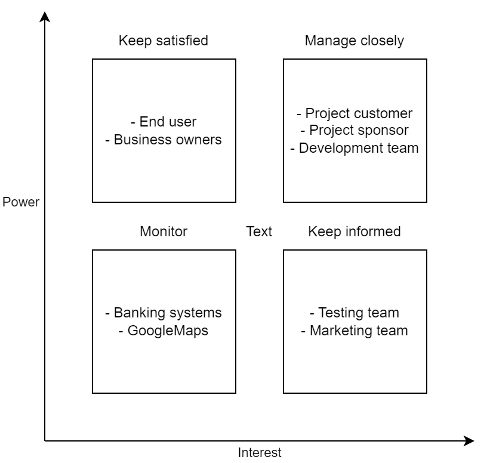

# Stakeholders analysis

# Stakeholders engagement
| Stakeholders         | Unaware | Resistant | Neutral | Supportive | Leading |
|----------------------|---------|-----------|---------|------------|---------|
| Project customer     |         |           |         |            | D C     |
| Project sponsor      |         |           |         |            | D C     |
| End-user             | C       |           |         | D          |         |
| Development team     |         |           | C       | D          |         |
| Testing team         |         |           | C       | D          |         |
| Marketing team       |         |           | C       | D          |         |
| Banking system       |         |           | C       | D          |         |
| Google Maps (Google) | C D     |           |         |            |         |
| Business owner       | C       |           |         | D          |         |

# Stakeholder communications management plan
| Message / Purpose                 | Responsibility | Audience         | Medium  | Content                                | Frequency |
|-----------------------------------|----------------|------------------|---------|----------------------------------------|-----------|
| Project status                    | PM             | Customer         | Meeting | SV, Demo, Issues, Risks, Demands       | Bi-weekly |
| Development team status           | PM             | Development team | Meeting | Project development status, SV, Risks  | Weekly    |
| Testing team status               | PM             | Testing team     | Meeting | Testing statues, SV, Risks             | Weekly    |
| Marketing team status             | PM             | Marketing team   | Meeting | Marketing status, SV                   | Bi-weekly |
| Authorization from the government | PM             | Banking system   | Meeting | Request of approval for operation      | Weekly    |
| Audit                             | QA             | PM, Team         | Meeting | SV, Current objectives of the project. | Monthly   |
