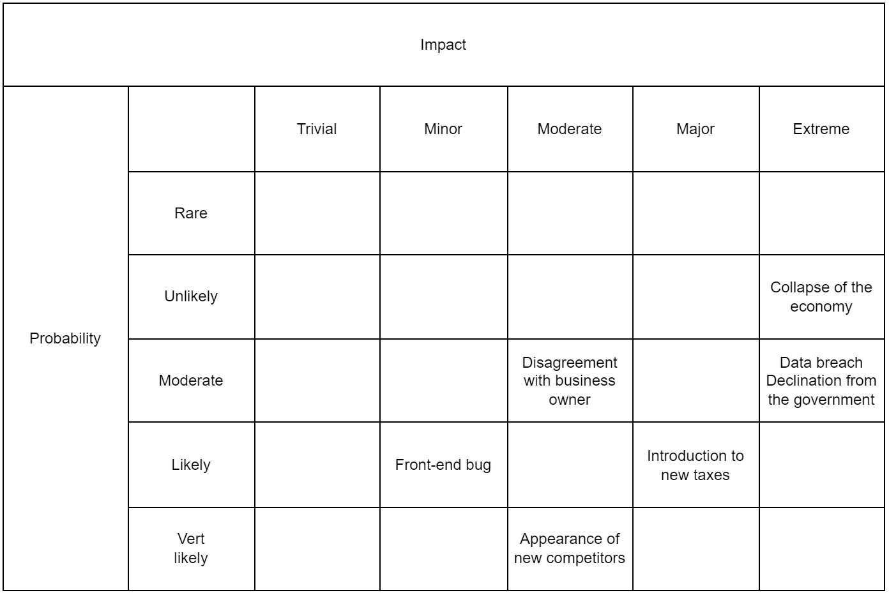

# Potential risks
- Data breach
- Declination of license from the government
- Front end bug
- Collapse of the country's economy
- Introduction to new taxes
- Appearance of new compeitiors

# Potential opportunties
- New market (Thus the need for such services)
- Lack of competitors
- No critical bugs on the software
- Cooperation from the government and the banking systems

# Risk assessment

# Risk mitigation
| Risk / Opportunity                | Responses |
|-----------------------------------|-----------|
| Data breach                       | Enhance   |
| Declination from the government   | Escalate  |
| Front-end bug                     | Enhance   |
| Collapse of the country's economy | Accept    |
| Introduction of new taxes         | Accept    |
| Lack of competitors               | Exploit   |
| New market                        | Exploit   |
| Cooperation of the banking system | Share     |
